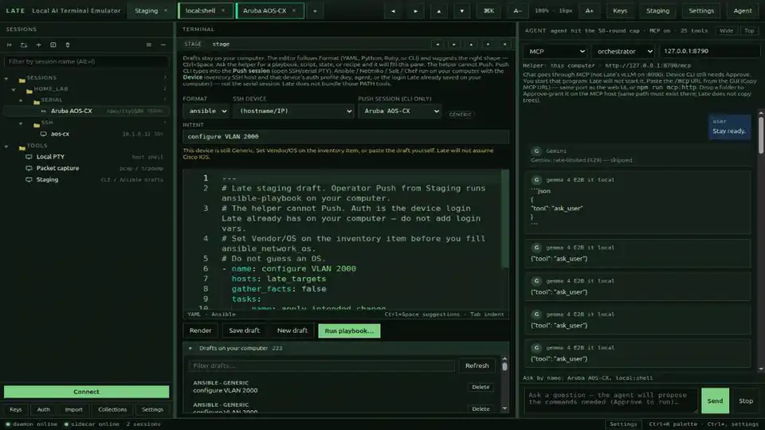

# Late

Late is a window on **your computer**. You use it to talk to network devices.

You can open a terminal (SSH), a serial port, a shell on this computer, copy files, look at packets, and save command drafts. A helper can *suggest* a command. Late will not send it until you click **Approve**. Passwords and keys stay on your computer.

## How it works

1. You add a device on the left (a name, an address, a login).
2. You click it. Late opens a terminal to that device.
3. You type, like any other terminal.
4. If you ask the helper, it may propose a command. You read it. You click **Approve** or **Deny**. It does not send on Enter, and it does not send by itself.
5. Cloud helpers stay **off** until you turn on **Cloud AI** in Settings. The usual helper is a model on your computer (**Local**) or on a GPU box you already started (**Add server**).

That is the whole idea.

## Watch it



## Install

The easy way: download a ready-made app from **[Releases](https://github.com/Unaware-Kerbin/late/releases)** (latest app tag is [v0.1.6](https://github.com/Unaware-Kerbin/late/releases/tag/v0.1.6)). Pick the file that matches your computer:

| Your computer | File | What you do |
|---|---|---|
| Windows | `Late-…-win-x64.exe` | Double-click. If Windows warns you, choose **More info** → **Run anyway**. |
| Mac (Apple chip, macOS 13+) | `Late-…-mac-arm64.dmg` | Open it. Drag Late into Applications. First time: **right-click** Late → **Open**. |
| Linux | `Late-…AppImage` or `Late-….deb` | AppImage: make it executable, then double-click. Ubuntu/Debian: install the `.deb`. |

The number in the file name is the app version. It can be older than the GitHub tag. These files are unsigned. SSH still uses the `ssh` program already on your computer.

If Releases has no app files yet, [build it yourself](#install-from-source).

## Install from source

Do this if you want to run Late from this folder. Install these **once**, then close the terminal and open a new one:

1. [Git](https://git-scm.com/downloads) — on Windows, use **Git Bash**.
2. [Node.js 22](https://nodejs.org/).
3. [Rust](https://rustup.rs/) — tap through the defaults.
4. Extra bits:
   - **Ubuntu / Debian:** `sudo apt install pkg-config libudev-dev build-essential openssh-client libudev1 tcpdump`
   - **Mac:** `xcode-select --install`
   - **Windows:** optional [Npcap](https://npcap.com/) or Wireshark if you want packet capture.

Then:

```bash
git clone https://github.com/Unaware-Kerbin/late.git
cd late
npm install
./late
```

The first start builds the backend. Wait. A Late window should open. If it does not, the terminal may print a local web address — open that.

No Git? On GitHub click **Code** → **Download ZIP**, unzip it, open a terminal in that folder, then `npm install` and `./late`.

On Linux, `./late --install` puts Late in the app menu. After that you can search for **Late**, or type `late`. If `late` is not found, log out and back in.

| Problem | Fix |
|---|---|
| `git: command not found` | Install Git. Open a new terminal. |
| `npm: command not found` | Install Node.js 22. Open a new terminal. |
| `cargo: command not found` | Finish the Rust install. Open a new terminal. |
| It builds, but no window | On Linux/macOS look at `/tmp/late-electron.log`, or open the address printed in the terminal. |

## After it opens

1. On the left, click **+** (or right-click **Sessions**) → **Add device**. Fill it in. Connect. The first time, click **Trust** for the host key (not Enter).
2. Helper is optional. See [The helper](#the-helper) — easiest on this computer: install [Ollama](https://ollama.com), pick **Ollama**, click **Local**, **Pull** a model (try `gemma4:e4b`).
3. **Staging** (Tools) is a scratch pad for CLI / Ansible drafts. **Push** is a click. The helper cannot Push.
4. On an SSH device, **SCP / SFTP** copies files. The helper cannot copy files.
5. Settings has **Keyword highlights** (`down` / `up` colors) and **Terminal font** / size.

## The helper

The helper is the chat pane on the right. It can *suggest* commands. You still click **Approve**.

Think of it as a brain in a box. You pick which box.

**This computer.** In the Agent pane, pick **Ollama**, **vLLM**, or **llama.cpp**. The next menu says **Local**. That means the box on *this* desk. You start the program here (Ollama is the easy one). Late **Start** / **Pull** / **Download** only work for Local. If this computer has more than one GPU, **Use all GPUs on this computer** is on by default (uncheck to use one card). Ollama already uses every GPU it sees.

**Another computer at home or in the lab.** You start the brain on *that* machine yourself (SSH into it if you want). Then in Late: same engine (vLLM / llama.cpp / Ollama) → open the menu under **Local** → **Add server**. Type the address, like `http://10.0.0.12:8000/v1`. Click **Check**, then **Save**. Next time that address is a row in the menu. Click **Local** to come home. Late will not press the power button on the other box for you.

That other box is still *your* network. Leave **Cloud AI** off. You do not need the internet.

**The public internet.** Cursor, Claude at Anthropic, Gemini at Google, Azure in the cloud. Settings → **Cloud AI** → Save. Then chat text may leave your computer. A GPU under your desk is not this.

**Claude, Gemini, or Azure on *your* network.** Settings has those names too. Point them at a box you run. Same rule: your network, Cloud AI off. The real anthropic.com / Google / public Azure sites still need Cloud AI.

If the box asks for a secret, Settings → API keys → **Custom OpenAI-compatible** (or Anthropic / Gemini / Azure). The helper still has to speak the usual chat HTTP (`/v1` for vLLM, Ollama, llama.cpp). A weird custom protocol needs something like LiteLLM in front. Details for developers are below.

**MCP as the agent.** In the Agent menu, pick **MCP** the same way you pick vLLM. Paste the `/mcp` URL printed when you started that program — **same port as its web UI**, not always 8790. The HTML page is not MCP. Or leave the address empty: Late looks for the URL that program wrote when it started (`mcp.gui.url` under that program’s config). Chat stays on MCP; it does not switch to Late’s local vLLM on `:8000`. Late still waits for **Approve** before device commands. You start that program; Late will not start it, and will not send API keys into it. Late still chats when MCP is off.

## Help

- Stuck or a bug: [GitHub Issues](https://github.com/Unaware-Kerbin/late/issues). Say your OS and what you expected. Do not paste passwords, keys, or `sidecar.token`.
- Security: [SECURITY.md](SECURITY.md).
- Late is **not** SOC 2 or ISO 27001 certified. Project notes: [docs/isms/](docs/isms/README.md). Changes: [CHANGELOG.md](CHANGELOG.md).

## For developers

### Daemon

The daemon is a JSON-RPC service on **127.0.0.1:7420**.

```bash
# from the repo root
cargo test -p late-core
cargo build -p late-daemon
cargo run -p late-daemon
# optional: cargo run -p late-daemon -- --bind 127.0.0.1:7420
```

Requires a Rust toolchain (`rustup`), and on Linux `pkg-config` plus `libudev-dev` (for serialport). SSH sessions spawn the system `ssh` binary via a PTY (passwords use `SSH_ASKPASS`, not the process environment). Packet capture spawns host `tcpdump`.

### HTTP / WebSocket

| Endpoint | Purpose |
|---|---|
| `GET /health` | Liveness |
| `POST /rpc` | JSON-RPC (same methods as the socket) |
| `WS /ws` | JSON-RPC + `session.data` events |

CORS is limited to the UI loopback origins (`127.0.0.1`/`localhost` on ports 5173, 4173, and 1420, plus Tauri). `/rpc` and `/ws` require the sidecar token (`X-Late-Token`, `Authorization: Bearer`, or the WebSocket subprotocol `late.<token>` — not a query string). The Host header must be loopback unless `LATE_INSECURE_BIND=1`. Daemon `GET /health` stays unauthenticated and returns `{"ok":true}` only.

Request:

```json
{ "id": "1", "method": "inventory.list", "params": {} }
```

Success:

```json
{ "id": "1", "result": { "...": "..." } }
```

PTY output event:

```json
{ "event": "session.data", "sessionId": "...", "data": "<base64>" }
```

Methods: `inventory.list|upsert|delete`, `auth.list|upsert|delete` (passwords go to the secret file — Unix mode 0600; Windows uses default NTFS ACLs on the config/data dirs — and are never returned), `settings.get|set`, `session.open` (`kind`: `ssh|serial|local|sftp|pcap|api`, `deviceId`, `acceptUnknownHost`, `cols`, `rows`, `shell`; `scp` is an alias for `sftp`), `session.close|input|resize|reconnect|list|break|scrollback`, `policy.check`, `sftp.list|get|put|mkdir|rm` (aliases `scp.list|get|put|upload|download`; `recursive` copies folders with `scp -r`), `pcap.interfaces|start|stop|open|packets|findings|query`, `api.request`, `import.file`, `collections.list|upsert`, `capture.save|diff|export`, `stage.render|save|get|list|plan|push`.

Agent tools call these same session/policy/pcap/api methods. The daemon does not talk to LLMs.

Config lives in the platform config directory named `late`: Linux `~/.config/late/`, macOS `~/Library/Application Support/late/`, Windows `%APPDATA%\late` (inventory, auth profiles, known hosts, settings, collections, `sidecar.token`, `secrets.json`). On Unix, secrets and tokens are mode 0600 and config/data dirs are 0700; Windows uses default NTFS ACLs on the config/data dirs. Session logs, captures, pcap, and `audit.jsonl` live in the platform data directory: Linux `~/.local/share/late/`, macOS `~/Library/Application Support/late/`, Windows `%APPDATA%\late`. Vendor permit lists ship in `policies/*.yaml` and are copied into the config `policies/` folder on first boot.

Session export with a passphrase is XOR obfuscation (`*.log.xor`), not age encryption. Encrypt the plaintext `.log` with the `age` CLI if you need real secrecy.

### Isolation CI

The **ci** workflow on each push is Rust tests, isolation greps, and advisory scans. It does **not** attach `.exe` / `.dmg` / AppImage files. Those come from **Build installers** on a `v*` tag and show up under [Releases](https://github.com/Unaware-Kerbin/late/releases).

`scripts/isolation-check.sh` and `cargo run -p isolation-check` grep `apps/agent-sidecar` so it must not contain `keyring`, `russh`, or `secrets.json` vault code, and must not call `stage.push` / `stage.plan` or file-transfer RPCs (`sftp.upload`, `scp.download`, and similar). That grep does not mean the sidecar never reads `sidecar.token` — it does, for auth. CI also runs `cargo audit` and `npm audit --omit=dev` as non-blocking advisory scans (`continue-on-error`).

## Layout

- `crates/late-core` — inventory, secrets, SSH/serial/PTY/SCP, policy, redact, pcap, API client, staging
- `crates/late-daemon` — Axum JSON-RPC daemon
- `crates/isolation-check` — sidecar firewall grep
- `policies/` — vendor YAML permit lists
- `apps/desktop` — Vite + React + xterm.js UI (Electron is the current shell; Tauri 2 is optional)
- `apps/agent-sidecar` — seven-tool agent (vLLM, llama.cpp, Ollama, Anthropic, Gemini, Azure, or Cursor SDK), including `propose_staged_artifact`
- `docker/` — optional Intel XPU vLLM example only

## Frontend + sidecar

See [Install from source](#install-from-source) to run the app. Development layout:

Node 22. Workspaces: `apps/desktop`, `apps/agent-sidecar`.

```bash
npm install
npm run typecheck
npm run dev                 # daemon if built + sidecar :7430 + Vite :5173
# or separately:
npm run dev:ui
npm run dev:sidecar
```

UI talks to the daemon at `http://127.0.0.1:7420` (`GET /health`, `WS /ws` JSON-RPC). Connection errors surface in the status bar and toasts — the views are wired even if the daemon is still catching up.

Agent chat talks to the sidecar at `http://127.0.0.1:7430` (`GET /health` returns `{"ok":true}` only — it does not include a daemon boolean; `POST /chat`, `GET /models`, `POST /probe`, `GET /pending`, `POST /approve`, `POST /stop`). Privileged sidecar routes take the token from `X-Late-Token` or `Authorization: Bearer` (not a `?token=` query string). vLLM: `http://127.0.0.1:8000/v1` (Agent **Local**) or one saved LAN URL (**Add server**). llama.cpp: `http://127.0.0.1:8080/v1`. Ollama: `http://127.0.0.1:11434/v1`. Cursor: `@cursor/sdk` with `tools: ["mcp"]` and Late `local.customTools` (including `propose_staged_artifact`, plus optional `mcp_*` when Settings **MCP** is on). `mcpServers` stays empty so those tools still go through Late Approve. Cursor chat is only after Settings **Cloud AI** is on. Public internet OpenAI-compatible URLs also need Cloud AI. Private RFC1918 / `.internal` URLs do not. Native Anthropic / Gemini / Azure adapters use the same private-vs-cloud gate. If the SDK import fails, the sidecar returns a clear error. vLLM Start/Download stay on the vLLM backend (Intel compose gate, loopback URL only). llama.cpp Download/Start and Ollama Pull are in the Agent pane when those backends are selected and the URL is this computer. Late does not SSH-start a remote vLLM. Optional MCP is a chat backend (Agent **MCP**, then This computer or an HTTP `/mcp` URL). Paste the printed URL (same port as that program’s web UI) or leave it empty so the sidecar can read the advertised `mcp.gui.url`. Agent=MCP does not fall back to Late vLLM on `:8000`. Extra `mcp_*` tools still work on other backends. `POST /probe` kind `mcp` works for both. Late does not start remote MCP.

Safety: dual-gate is sidecar-only. On network OS CLI, `propose_command` runs the vendor permit list, then you click **Approve**. Linux CLI has no permit list (Approve every command). `propose_api_get` is operator click only (no vendor permit list). Always-allow (non-Linux) still re-runs the permit check. Daemon `session.input` is ungated for a client that already has the token. Operator **Push** from Staging is UI-only (`stage.plan` / `stage.push`): CLI types into an open SSH/serial session; Ansible / Netmiko / Salt / Chef run PATH tools on your computer (Late does not bundle them). PATH Push uses the inventory device’s auth profile (key, agent, or a password already in the daemon vault — injected at run time, never written into staging files). The helper cannot Push. Host-key and approval dialogs are not dismissed by clicking outside. **Trust**, **Approve**, and Staging **Push** need an explicit button click (not Enter). Escape does not Trust. The sidecar reads `sidecar.token` for auth; it must not contain keyring, russh, or `secrets.json` vault code.

When the operator asks a specific question, the agent proposes the show/display/GET needed to answer it. After **Approve**, it sends the command, reads the device output, and continues. If it finds a problem, it also proposes the specific command to implement the fix (still gated the same way).

### Native window

The UI is a React app. Two native shells wrap it:

**Electron (works without extra system packages):** with the daemon, sidecar, and Vite already running:

```bash
npm run native
```

`npm run native` also passes `--no-sandbox` on every OS. Use it only with daemon, sidecar, and Vite already running. Packaged Release binaries do not set this flag.

**Tauri 2** (`apps/desktop/src-tauri`) is the planned Linux-native binary. It needs GTK/WebKit headers:

```bash
sudo apt install libwebkit2gtk-4.1-dev libgtk-3-dev \
  libayatana-appindicator3-dev librsvg2-dev patchelf
cd apps/desktop && npx tauri dev
```

### Build installers

GitHub Actions packages Linux, macOS, and Windows when a `v*` tag is pushed (workflow **Build installers**). Finished files are on the Release for that tag, not in the **ci** job log. Pack each OS on a computer running that OS:

```bash
npm install
./scripts/pack.sh
```

Artifacts land in `apps/desktop/release/`.

### Local inference (any GPU)

Late does not bundle CUDA, ROCm, oneAPI, Ollama, llama.cpp, or model weights. The agent talks to a local vLLM (or llama.cpp / Ollama) on loopback. NVIDIA, AMD, and Intel are all fine if the server you run uses that GPU.

See `docker/README.md` for the full matrix. Short version:

| Agent pane | Default URL | Typical runtime |
|---|---|---|
| Ollama | `http://127.0.0.1:11434/v1` | Ollama (install yourself; Pull from the Agent pane) |
| llama.cpp | `http://127.0.0.1:8080/v1` | `llama-server` (CUDA, Vulkan, Metal, ROCm, or CPU) |
| vLLM | `http://127.0.0.1:8000/v1` | vLLM on NVIDIA, AMD, or Intel |

`docker/compose.yml` is an **optional Intel XPU** vLLM example only. NVIDIA/AMD users should not start from that file.

```bash
# optional Intel Arc / XPU compose
./docker/detect-gpus.sh docker/.env
docker compose -f docker/compose.yml up
```

### Another computer (homelab / no internet)

Same as [The helper](#the-helper): **Local** vs **Add server**. You start the program on the other machine. Late only calls it.

On that machine, listen on the LAN, not only `127.0.0.1`:

```bash
# Ollama
OLLAMA_HOST=0.0.0.0 ollama serve

# llama.cpp
llama-server -m /path/to/model.gguf --port 8080 --host 0.0.0.0
```

Open the port on that machine’s firewall. **Check** (Add server or Settings) hits `GET /v1/models` (Ollama also tries `/api/tags`). Need a name that is not a `10.` / `192.168.` address? Settings → **Private inference hosts**. Token? **Custom OpenAI-compatible** key.

Chat still needs OpenAI-style `/v1` (vLLM, llama.cpp, Ollama, LiteLLM, LocalAI). Custom RPC is not Late’s job.

Anthropic is `POST /v1/messages`. Gemini is `:generateContent`. Azure is deployment chat completions and an `api-key` header. A proxy on your LAN is not Cloud AI. `api.anthropic.com`, `generativelanguage.googleapis.com`, and public `*.openai.azure.com` are. Keys: Anthropic, Gemini, Azure (or `ANTHROPIC_API_KEY` / `GEMINI_API_KEY` / `AZURE_OPENAI_API_KEY`).

### Ollama (optional — easiest local AI)

Late does not install Ollama. On [ollama.com](https://ollama.com), download the installer for your OS, open it, and wait until Ollama is running (it stays in the background). In Late’s Agent pane choose **Ollama**, keep **Local**, then **Pull** a name such as `gemma3:4b` or `qwen3:8b`. A Hugging Face id also works (`google/gemma-3-4b-it-qat-q4_0-gguf`; Late sends it as `hf.co/…`). Pull only talks to Ollama on this computer. Another machine: **Add server**. Default API: `http://127.0.0.1:11434/v1`.

### llama.cpp (optional)

Late does not install llama.cpp. Build or install [llama.cpp](https://github.com/ggml-org/llama.cpp) with the backend you want (CUDA, Vulkan, Metal, ROCm, or CPU). In the Agent pane choose **llama.cpp**, **Download** a GGUF Hugging Face id (for example `Qwen/Qwen3-8B-GGUF`, `google/gemma-3-4b-it-qat-q4_0-gguf`, or `…:Q4_K_M`). Files land in `~/.local/share/late/models/gguf/` (not the Intel vLLM Docker cache). **Start** runs `llama-server` on loopback if it is on `PATH`; otherwise run it yourself. With more than one GPU, Start adds `-ngl 99 -sm layer` so layers are shared (uncheck **Use all GPUs** to stay on one card):

```bash
llama-server -m ~/.local/share/late/models/gguf/Qwen--Qwen3-8B-GGUF/*.gguf --port 8080 --host 127.0.0.1
```

Default API: `http://127.0.0.1:8080/v1`. Gated Hub repos need `HF_TOKEN` in the environment. vLLM Docker Start/Download stay hidden when llama.cpp is selected.
